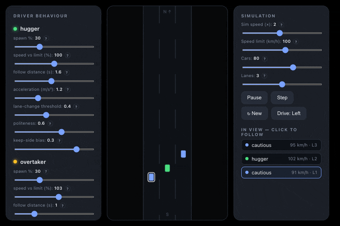

# Traffic Microsim

[](#entirely-ai-generated)
[](https://saintpepsi.github.io/traffic-microsim/)
[](LICENSE)

A single-file, dependency-free traffic microsimulation you run by double-clicking. Cars with distinct personalities follow, overtake, and jam on an **open multi-lane road** — traffic flows in upstream, merges from an **on-ramp**, and exits downstream, so congestion builds *and drains* like the real thing. A live **space–time diagram** shows the whole road's history at a glance.

**▶ Live demo: https://saintpepsi.github.io/traffic-microsim/**



## What it does

Every tick, each car makes two decisions — how fast to go, and whether to change lanes — using two classic, well-known models:

- **IDM (Intelligent Driver Model)** for car-following: a car accelerates toward its desired speed and brakes for the car ahead, keeping a *time-based* gap (the 2-second rule). [Reference](https://en.wikipedia.org/wiki/Intelligent_driver_model)
- **MOBIL** for lane changes: a car switches lane if it gains acceleration (and a keep-side bias nudges it), as long as it won't force the new follower to brake too hard. [Reference](https://traffic-simulation.de/info/info_MOBIL.html)

All driving personality is **data** — there are no `if (type === 'overtaker')` branches anywhere. Four profiles fall out of the parameters:

| Profile | Behaviour |
|---|---|
| 🟢 **Hugger** | Sits in the slow lane, rarely moves |
| 🟡 **Overtaker** | Weaves through traffic to get ahead |
| 🔵 **Cautious** | Slower, big following gaps |
| 🔴 **Aggressive** | Tailgates, accelerates hard |

### Open road + on-ramp bottleneck

The road is **open**: traffic enters upstream at an adjustable inflow, exits (and is removed) downstream, and a metered **on-ramp** merges into the mainline partway along. Crank the ramp demand up and merging cars force the mainline to brake — a **capacity drop** that backs a jam *upstream*; ease the demand and the jam drains. That's the classic on-ramp bottleneck, the dominant cause of real-world jams.

### Lane discipline — a built-in experiment

A **Lane discipline** control models *"slower traffic keep inner"*: cars below the limit are pulled toward the inner lane so faster traffic can use the outer lanes to overtake (they still pull out when blocked — "unless overtaking"). Slide it and watch the live **Traffic metrics** — mean speed, flow efficiency, % crawling — to test whether discipline actually eases congestion.

### Space–time diagram

The right pane is the analyst's view: **position along the whole road (vertical) × time (horizontal) × speed (colour)** — green is free-flow, red is stopped. A jam shows up as a red band that grows *downward* as it backs up upstream. It captures far more road and time than any live window can, which is exactly how traffic engineers read corridor congestion.

## Controls

- **Driver behaviour (left):** per-type spawn %, speed vs the limit, following distance, acceleration, lane-change eagerness, politeness, keep-side bias — all editable live, with a **?** tooltip on each.
- **Simulation (right):** sim speed, zoom, speed limit (soft — drivers scatter around it), mainline inflow, on-ramp inflow, lane count, lane discipline, drive-on-left/right, pause/step, and a clickable list of cars in view to follow.

## How it's built

The simulation core is pure functions (`idmAccel`, `mobilDecision`, `stepLongitudinal`, `stepLateral`, `stepRamp`) with no DOM access, so it's deterministic and testable; a separate `render()` reads state and draws to a canvas. The open road uses **O(log n) binary-search neighbour lookups** so it stays smooth as the car count climbs. A space–time sampler bins mean speed along the road and scrolls one column per second of sim time. A set of `console.assert` invariants — including a binary-vs-brute-force neighbour-equivalence check — run on load (open DevTools to see them pass).

## Run locally

```bash
git clone https://github.com/SaintPepsi/traffic-microsim.git
open traffic-microsim/index.html      # or just double-click it
```

## Entirely AI-generated

This project — the simulation code, the UI design, this README, even the demo GIF — was built **entirely by an AI agent** (Claude, via Claude Code) through a conversation: brainstorming the IDM/MOBIL approach, implementing it test-first, then evolving it from a closed ring into an open road with an on-ramp bottleneck, a lane-discipline experiment, and a space–time diagram. No line was hand-written by a human. The commit history is the full record.

## License

MIT — see [LICENSE](LICENSE).
